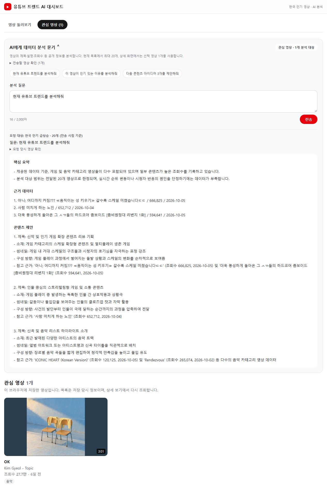
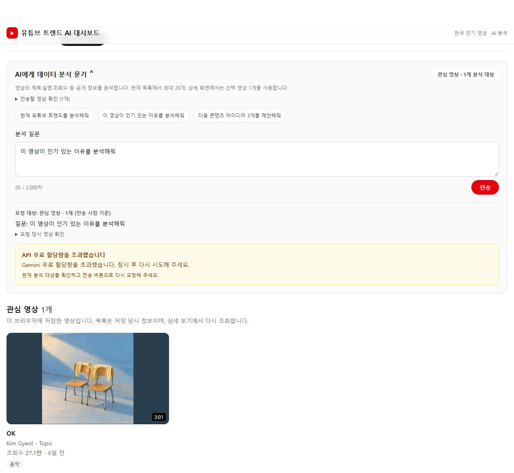

# 배포 검증 및 제출물

검증일: **2026-10-06 (KST)**. [저장소](https://github.com/cjw1645/youtube_trend) · [Production 서비스](https://youtube-trend-orpin.vercel.app)

## 실제 연동

- Production에서 실제 YouTube 목록 50개, 음악 카테고리, 최신순·조회수순, `김결 OK` 검색, 상세 정보를 확인했다. 카테고리 일치와 정렬 순서는 API 값으로도 대조했다.
- 관심 영상 저장 후 새로고침해 유지되는 것을 확인하고 테스트로 추가한 영상은 해제했다.
- 17:23 KST에 실제 YouTube와 Gemini로 예시 질문 세 종류를 대상 3/1/2개로 검증했다. 모두 HTTP 200, `no-store`, 필수 섹션 세 개, 제안 세 개와 데이터 부족 안내를 확인했다. 모델은 `gemini-3.5-flash-lite`였다.
- 근거 대조: ANIMAL / 11,109,111 / 2026-09-28, Dear my crazy soulmate / 10,684,540 / 2026-09-10, 꿈꾸던 어른이 되었나요? / 7,684,642 / 2026-09-11. 조회수는 검증 당시 값이다.
- UI 정리 배포 후 실제 목록 20개를 대상으로 트렌드 분석을 전송했다. 대상 내 상위 세 영상의 조회수 666,825·652,712·594,641 및 업로드일을 대조하고 제안 세 개를 확인했다. 관심 목록으로 이동해도 원래 목록 20개라는 답변 대상이 유지됐다.

## 보안·실패 경로

- Production/Preview의 두 Key 등록 여부를 값 없이 확인했다. Production에는 fixture·오류 재현 설정이 없으며, 서버 가드가 오설정된 테스트 플래그도 무시한다.
- 환경 파일을 읽지 않고 추적 소스·Git 이력·배포 JS/CSS·목록/카테고리/상세 및 챗 오류 응답을 검사했다. Google Key·개인키 패턴 탐지와 클라이언트 직접 Google 호출·서버 Key 읽기·`VITE_` 사용 탐지 모두 0건이었다. 이는 명시한 패턴과 검사 대상 범위의 결과다.
- Production의 잘못된 챗 요청은 외부 호출 전에 400으로 거부하고 `no-store`를 반환했다.
- 로컬 서버 전용 설정으로 YouTube 할당량, Gemini 429·502·504를 재현했다. 안내·수동 재시도·전송 버튼 복구를 확인했고 재현 서버는 종료했다. 공개 쿼리나 실제 Key 변경은 사용하지 않았다.
- Production 빌드의 일반 오류 UI는 로컬 `vite preview`에서 API가 없는 조건으로 확인했다. 목록·카테고리 오류와 재시도 버튼이 표시됐다. 실제 Vercel 장애나 실제 할당량 소진을 일으킨 검증은 아니다.

## 자동 검증과 화면

빌드와 상세·관심·상태·Gemini·챗 계약·프롬프트·챗 UI·서버 실행 모드 테스트가 통과했다. 누락 통계의 null/0 구분, 손상된 저장소, 지연 응답 차단, 중복 전송, 대상 0/1/2/20/21개, 입력 제한, HTML 이스케이프와 Production 테스트 설정 무시를 포함한다. 모바일 390×844에서 가로 넘침이 없고 상세 모달의 Tab·Escape·포커스 복귀를 확인했다.

| 리뷰 기준 | 결과 |
|---|---|
| API 연동·보안 | 실제 서버 API 성공, 서버 전용 Key 경계·비밀 파일 제외·배포 응답 검사 통과 |
| 기능 완성도 | 목록·검색·필터·정렬·상세·관심 저장 및 상태 분기 확인 |
| 챗봇 품질 | 실제 세 질문과 20개 대상 검증, 근거 값·대상 범위·부족 안내 확인 |
| 코드·화면 | 챗 결과 분리·공용 표시 재사용, 모델명/원시 ID 표시와 중복 도구 제거, 반응형·키보드 확인 |
| 배포 | main 자동 배포 Ready 및 실제 Production UI/API 확인 |

## 화면 캡처

### 1. 실제 YouTube 조회

URL: https://youtube-trend-orpin.vercel.app/ · 2026-10-06 · **Production 실제 데이터**. 기본 챗 패널은 접힌 상태로 영상 탐색을 우선한다.

### 2. 실제 Gemini 답변

URL: https://youtube-trend-orpin.vercel.app/ · 2026-10-06 · **Production 실제 YouTube + 실제 Gemini**. 목록 20개로 전송한 뒤 관심 목록으로 이동한 화면이며, 답변의 원래 분석 대상은 유지된다.

### 3. 할당량 초과 안내

URL: http://localhost:3014/ · 2026-10-06 · **로컬 모의 오류**. `USE_FIXTURES=1`, `API_TEST_GEMINI_ERROR=quota`로 429를 재현했다. 실제 Gemini 할당량 소진이나 고정 성공 답변이 아니다. 안내와 전송 버튼 복구 확인 후 서버를 종료했다.

실제 AI 답변은 실행마다 달라질 수 있고 무료 할당량·영상 통계도 변한다. 이번 검증은 위 날짜·데이터·조건에서의 결과이며 재검증 방법은 [README](../README.md), 단계별 기록은 [MILESTONE](../MILESTONE.md)에 있다. 환경변수 이름만 있는 [.env.example](../.env.example)을 함께 제출한다. 실제 환경 파일·내부 PDF·판단 기록은 Git에서 제외한다.
